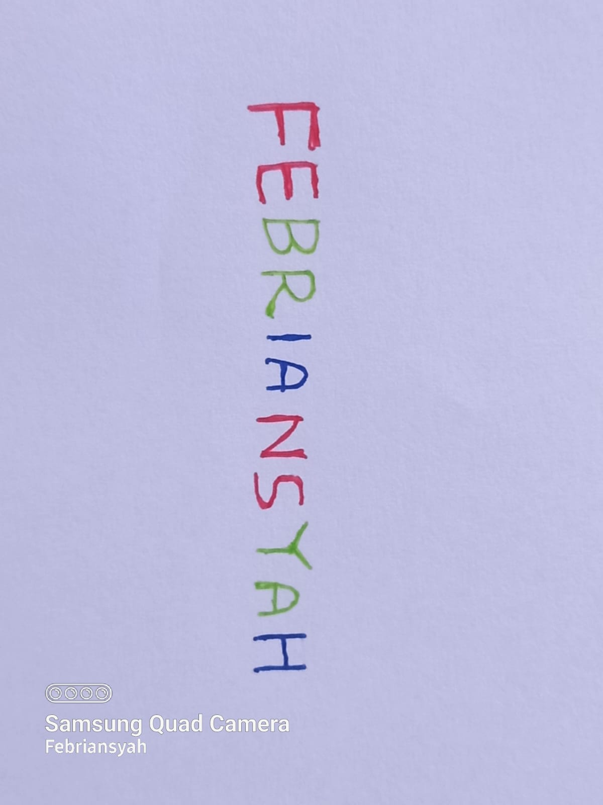
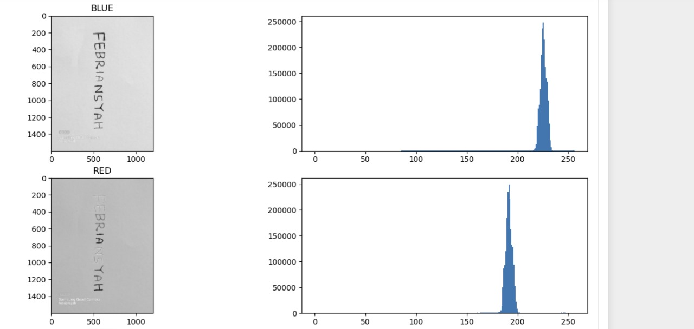
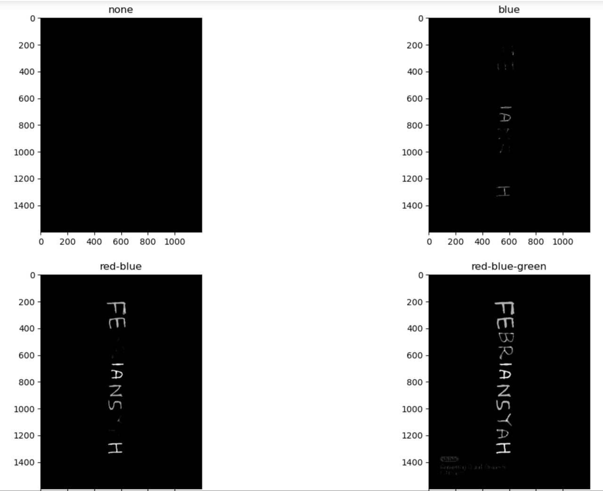

# Laporan Praktikum UTS - Pengolahan Citra Digital B


## Authors
    Nama        : Febriansyah
    NIM         : 202231049
    Mata Kuliah : Pengolahan Citra Digital B 
- [@Suryzw](https://github.com/Suryzw)


## Roadmap

- Menampilkan Citra
- Mendeteksi warna Red, Green, dan Blue
- Mencari nilai ambang batas untuk setiap warna Red, Green, dan Blue


## Teori Pendukung

- Library `cv2` adalah singkatan dari OpenCV (Open Source Computer Vision Library), sebuah library open-source yang berisi berbagai fungsi dan algoritma untuk pengolahan citra dan visi komputer. Library ini menyediakan berbagai fitur untuk memproses gambar dan video, seperti manipulasi citra, deteksi objek, pengenalan pola, dan banyak lagi.
- Library `matplotlib.pyplot` adalah bagian dari paket matplotlib, yang merupakan library Python yang digunakan untuk membuat visualisasi data dalam bentuk grafik. 
- Library `numpy` adalah library Python yang berfokus pada operasi numerik. NumPy menyediakan objek array yang mendukung array multidimensi dan berbagai fungsi untuk bekerja dengan array tersebut. 
- Fungsi `cv2.imread()` digunakan untuk membaca file gambar kita
- Fungsi `cv2.cvtColor()` digunakan untuk mengkonversi warna gambar
- Fungsi `cv2.split()` digunakan dalam OpenCV untuk memisahkan saluran warna dari suatu citra. Secara khusus, fungsi ini memisahkan citra yang terdiri dari beberapa saluran warna (seperti citra RGB) menjadi saluran warna yang terpisah.
- Fungsi `plt.subplots()` dalam matplotlib.pyplot digunakan untuk membuat subplot atau beberapa plot dalam satu gambar. Fungsi ini mengembalikan dua objek: sebuah objek gambar (figure) dan sebuah array dari objek sumbu (axes).
- Fungsi `cv2.threshold()` dalam OpenCV digunakan untuk melakukan proses thresholding pada citra. Thresholding adalah proses mengubah citra menjadi citra biner, di mana setiap piksel memiliki nilai 0 (hitam) atau 255 (putih), tergantung pada apakah nilainya di atas atau di bawah ambang tertentu.

## Langkah Pengerjaan

1. Gunakan [Jupyter Notebook](https://jupyter.org/install) atau [Google Colabs](https://colab.google/) 
2. Buat file .ipynb baru
3. Import library yang dibutuhkan, seperti `cv2`, `matplotlib.pyplot`, dan `numpy`

    ```
    import cv2
    import matplotlib.pyplot as plt
    import numpy a np
    ```
4. Import gambar yang ingin digunakan, dalam hal ini saya gunakan file dengan nama **cpy10.jpg**.


Menyimpannya ke dalam variabel `img`. Setelahnya, kita mengkonversi gambar dari BGR ke RGB. Gunakan perintah berikut:
    ```
    img = cv2.imread('cpy10.jpg') #untuk mengimport gambar
    img = cv2.cvtColor(img, cv2.COLOR_BGR2RGB) #konversi BGR ke RGB
    ```

6. Gunakan perintah berikut untuk mendeteksi warna merah, hijau, dan biru pada citra.
    ```
    red, green, blue = cv2.split(img)
    ```

7. Untuk menampilkan gambar yang sudah di filter, dapat menggunakan perintah berikut : 
    ```
    fig, axs = plt.subplots(4,2,figsize=(15,15))
    axs[0,0].imshow(img) # Menampilkan gambar original
    axs[0,0].set_title("ORIGINAL")
    axs[0,1].hist(img.ravel(), 256, [0,256])

    axs[1,0].imshow(blue, cmap="gray") #Memfilter warna biru
    axs[1,0].set_title("BLUE")
    axs[1,1].hist(blue.ravel(), 256, [0,256])

    axs[2,0].imshow(red, cmap="gray") #Memfilter warna merah
    axs[2,0].set_title("RED")
    axs[2,1].hist(red.ravel(), 256, [0,256])

    axs[3,0].imshow(green, cmap="gray") #Memfilter warna hijau
    axs[3,0].set_title("GREEN")
    axs[3,1].hist(green.ravel(), 256, [0,256])
    plt.show()
    ```
Hasil screenshot:



**Hasil Analisis pada langkah 6 :** 

Berdasarkan hasil output, dapat dilihat bahwa setelah memasukkan filter tertentu sebagai parameter, warna tersebut menjadi lebih terang dari warna yang lainnya. Dilihat dari range histogram, warna biru memiliki range dari +-70 hingga 255 dan mencapai puncaknya pada range 220 sampai 240. Warna merah mencapai puncaknya pada range 160 hingga 200. Terakhir, warna hijau berada di range yang hampir sama dengan warna merah, yaitu sekitar 180 hingga 200.

7. Untuk mencari nilai ambang batas pada setiap warna, dapat dilakukan dengan menuliskan kode berikut:
    ```
    fig, axs = plt.subplots(2,2,figsize=(15,10))

    axs[0,0].set_title("none")
    (threshold, binary) = cv2.threshold(img,1,255 ,cv2.THRESH_BINARY)
    gray = cv2.cvtColor(binary,cv2.COLOR_RGB2GRAY)
    axs[0,0].imshow(gray, cmap="gray")

    axs[0,1].set_title("blue")
    (threshold, binary) = cv2.threshold(img,52,255,cv2.THRESH_BINARY)
    gray = cv2.cvtColor(binary,cv2.COLOR_RGB2GRAY)
    axs[0,1].imshow(gray, cmap="binary")

    axs[1,0].set_title("red-blue")
    (threshold, binary) = cv2.threshold(img,90,255,cv2.THRESH_BINARY)
    gray = cv2.cvtColor(binary,cv2.COLOR_RGB2GRAY)
    axs[1,0].imshow(gray, cmap="binary")

    axs[1,1].set_title("red-blue-green")
    (threshold, binary) = cv2.threshold(img,150,255,cv2.THRESH_BINARY)
    gray = cv2.cvtColor(binary,cv2.COLOR_RGB2GRAY)
    axs[1,1].imshow(gray, cmap="binary")

    plt.show()
    ```
Hasil Screenshot : 


Untuk menentukan ambang batas dari setiap warna, kita bisa menggunakan fungsi **cv2.threshold**. Nantinya kita akan menentukan sampai di berapa x,y warna tersebut akan muncul. Contohnya, untuk warna biru, berdasarkan kode, memiliki ambang batas pada range `52,255`. Warna merah memiliki ambang batas `90,255`. Warna hijau memiliki ambang batas `150-255`. 
